# Minicurso de GIT/GitHub do GETComp UFJF!

Nesse minicurso vamos ensinar o básico de como usar essa ferramenta MEGA importante para nós alunos da computação.

Aqui vamos usar a IDE [Visual Studio Code](https://code.visualstudio.com/) para facilitar a compreensão do minicurso. Se não tiver instalado, recomendamos a instalação. 

---

## O que é GIT e GitHub?

**GIT** é uma ferramenta de versionamento. Dentro dela, podemos "documentar o passo a passo" do que fizemos no código em um **repositório**. Isso permite que a gente salve diferentes versões do mesmo programa e volte a versões anteriores quando der problema. 
**GitHub** é onde nós vamos colocar o repositório, para que ele fique disponível para mais pessoas acessarem eles. Isso é muito importante porque é o que permite que fáçamos trabalhos em grupo sem precisar enviar .rar no whatsapp.

## Como obter o GIT?

Você pode obter o GIT clicando [aqui](https://git-scm.com/downloads). 

## Como criar uma conta no GitHub?

Crie sua conta no site em que está vendo isso. Ele é o GitHub. **FAÇA COM SEU E-MAIL PESSOAL** 
e com um *nickname* **NORMAL**, nada de "EnzinhoBalaTensa2009". Afinal, ele pode ser usado como seu currículo.

Lembre-se que você pode adquirir o [GitHub Estudante](https://docs.github.com/pt/education/about-github-education/github-education-for-students/apply-to-github-education-as-a-student), o que te dá acesso a muitos benefícios como o Github Copilot,
uma IA que te auxilia a escrever códigos (use com responsabilidade).

---
## Criando um repositório

Vá no canto superior direito do GitHub e clique no '+':


Depois, preencha as informações do repositório (Recomendamos deixar nessas configurações, principalmente adicionando o README):
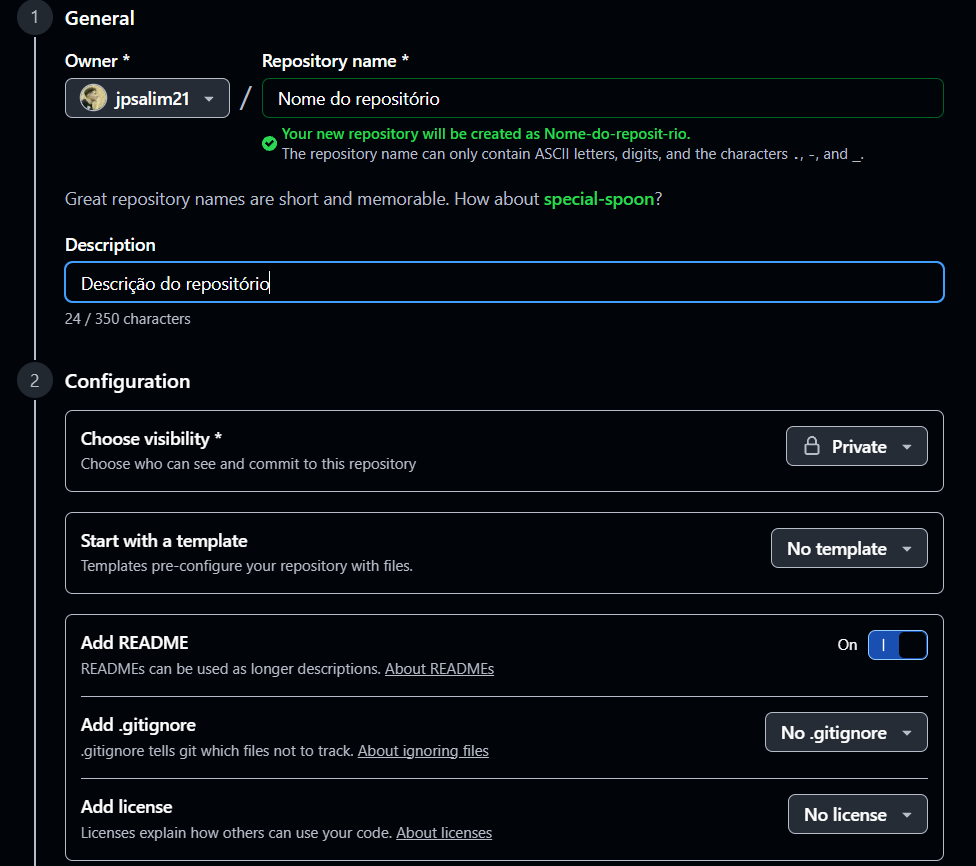

Terminando de preencher as informações e confirmando, seu repositório foi criado!

Ótimo, agora precisamos colocar o repositório no nosso computador. Esse processo é o mesmo tanto para um repositório seu quando de outra pessoa. Para isso, siga a imagem:
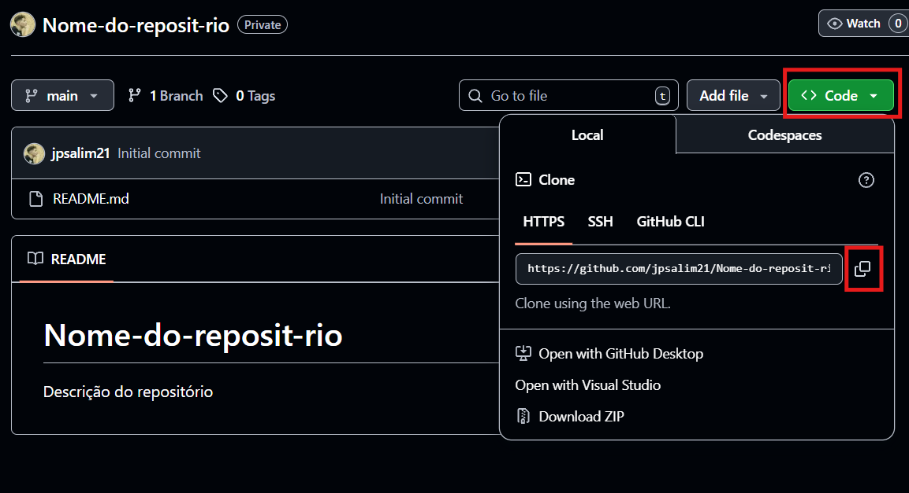

E depois, vá no Visual Studio e clique nos botões da imagem para depois colar (Ctrl+V e Enter):
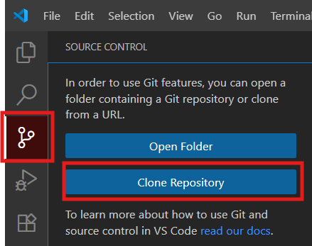

E agora, parabéns! Seu repositório já está na sua máquina. 

## Configurando sua máquina

Depois de instalar o git e criar o repositório, precisamos configurar a máquina para usarmos esses recursos.
Se você estiver na **sua máquina**, abra o terminal do computador (procure CMD no pesquisar ou apenas Ctrl+J no Visual Studio Code) e digite o comando:
```bash
git config --global user.name "Seu nome aqui"
git config --global user.email "seu_email@gmail.com"
```
Se você estiver em uma **máquina pública**, como da UFJF, digite os seguintes comandos na pasta do repositório:
```bash
git config user.name "Seu nome aqui"
git config user.email "seu_email@gmail.com"
```
Essa diferenciação acontece porque na sua máquina será somente você, então configuramos com o "--global" para afetar todos os repositórios. Na máquina pública, configuramos apenas aquele repositório.

## E o que eu faço agora?

Bom, o espaço para o seu repositório já está arrumado. Agora, precisamos apenas criar código para colocar no repositório.

Comece criando um novo arquivo com nome "teste.txt", escreva o que quiser dentro dele e salve.

Agora, note que há ícone de "Branch" na esquerda um pouco destacado.
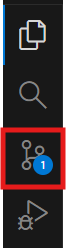

Agora, note que na nova aba, todas as suas modificações da última vez que fez um commit, como indicado na imagem:
**IMPORTANTE**: Lembre-se de escrever algo na mensagem de commit.
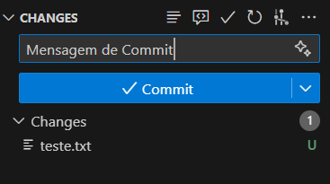

Ao clicar em Commit, você aplicará as suas modificações no repositório local. Note que, nesse estado, as suas modificações não estarão no repositório no site do GitHub, mas estarão no seu computador. Para enviar para o repositório online para, por exemplo, permitir que eu colega acesse suas modificações, clique em Sync Changes
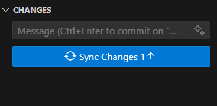

## Branches, o que são, onde vivem, o que comem? Hoje, no GETReporter...
Branches, tranduzindo, são ramificações. Imagine que em todos os repositórios há uma via principal (a branch main) e nós podemos criar ramificações que são 'cópias' da 'main'. Essas ramificações são formas de alterar diferentes partes do código de forma separada, é como ter um repositório para cada parte do projeto. E isso também permite que cada pessoa altere uma branch sem causar confusão por mexerem na mesma. 

### Criando uma branch
Você pode criar uma branch facilmente indo no ícone de branches novamente. E indo nessas direções:
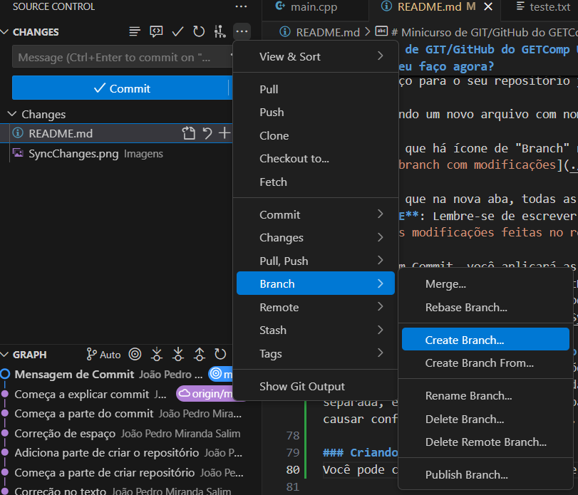

E escreva o nome da branch e dê enter:
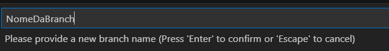

Ótimo, você acabou de criar sua branch e está nela atualmente. Todas as suas modificações ficarão salvas naquela branch

### E como trocar de branch?
Bom, digamos que vc quer ver como está o andamento da parte do seu amigo e quer visitar a branch dele. Você pode fazer isso facilmente apenas mudando a branch. Siga esses passos para trocar de branch:
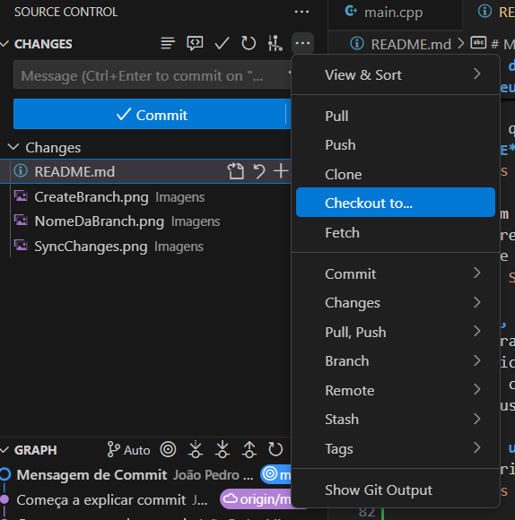

E clique na branch selecionada com o símbolo de nuvem, o que seleciona a versão online daquela branch. 
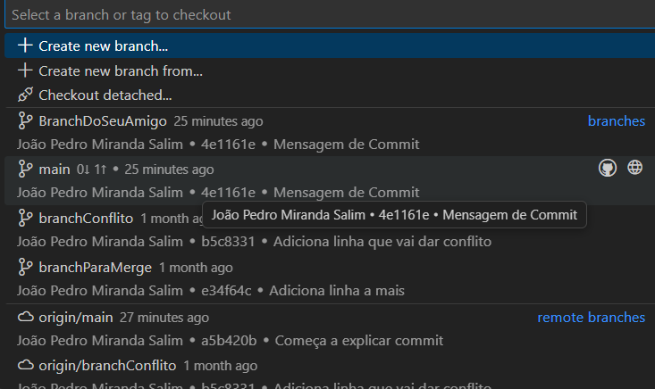

E pronto, você está agora na branch escolhida.

### Merge: Como juntar duas branches?
Bom, você e seu amigo terminaram suas partes e precisam juntar agora. Juntar na mão não é uma opção. Existe o merge, que já junta automaticamente as branches. Para isso, vá para a branch que ficará tudo junto e faça:

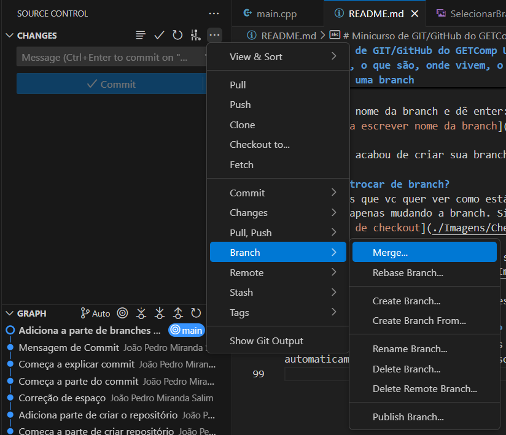

E escolha a branch do seu amigo

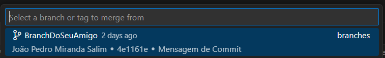

E pronto! Se tudo estiver correto, vai juntar perfeitamente.

### E se der problema? O famoso problema de merge?
Bom, como isso acontece? Normalmente, acontece por vocês mexerem na mesma parte de código, alterando coisas diferentes.

Agora, para aprender como fazer isso, crie um arquivo main.cpp com um "Hello World" simples. Crie 2 outras branches derivadas da main e, em cada uma, altere a mensagem dentro do cout para coisas diferentes.
Note aqui, que, ao fazer o merge, o Git não pode assumir o que deveria estar escrito na mensagem do cout e por isso é você quem deve definir isso. Algumas vezes isso pode ser simples e outras vezes pode ser algo muito chato de fazer, por isso, tome seu tempo e tente aprender corretamente.

Resolvemos conflitos de merge assim:
