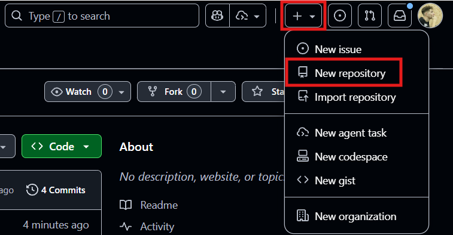

# Minicurso de GIT/GitHub do GETComp UFJF!

Nesse minicurso vamos ensinar o básico de como usar essa ferramenta MEGA importante para nós alunos da computação.

Aqui vamos usar a IDE [Visual Studio Code](https://code.visualstudio.com/) para facilitar a compreensão do minicurso. Se não tiver instalado, recomendamos a instalação. 

---

## O que é GIT e GitHub?

**GIT** é uma ferramenta de versionamento. Dentro dela, podemos "documentar o passo a passo" do que fizemos no código em um **repositório**. Isso permite que a gente salve diferentes versões do mesmo programa e volte a versões anteriores quando der problema. 
**GitHub** é onde nós vamos colocar o repositório, para que ele fique disponível para mais pessoas acessarem eles. Isso é muito importante porque é o que permite que fáçamos trabalhos em grupo sem precisar enviar .rar no whatsapp.

## Como obter o GIT?

Você pode obter o GIT clicando [aqui](https://git-scm.com/downloads). 

## Como criar uma conta no GitHub?

Crie sua conta no site em que está vendo isso. Ele é o GitHub. **FAÇA COM SEU E-MAIL PESSOAL** 
e com um *nickname* **NORMAL**, nada de "EnzinhoBalaTensa2009". Afinal, ele pode ser usado como seu currículo.

Lembre-se que você pode adquirir o [GitHub Estudante](https://docs.github.com/pt/education/about-github-education/github-education-for-students/apply-to-github-education-as-a-student), o que te dá acesso a muitos benefícios como o Github Copilot,
uma IA que te auxilia a escrever códigos (use com responsabilidade).

---
## Criando um repositório

Vá no canto superior direito do GitHub e clique no '+':


Depois, preencha as informações do repositório (Recomendamos deixar nessas configurações, principalmente adicionando o README):


Terminando de preencher as informações e confirmando, seu repositório foi criado!

Ótimo, agora precisamos colocar o repositório no nosso computador. Esse processo é o mesmo tanto para um repositório seu quando de outra pessoa. Para isso, siga a imagem:


E depois, vá no Visual Studio e clique nos botões da imagem para depois colar (Ctrl+V e Enter):


E agora, parabéns! Seu repositório já está na sua máquina. 

## Configurando sua máquina

Depois de instalar o git e criar o repositório, precisamos configurar a máquina para usarmos esses recursos.
Se você estiver na **sua máquina**, abra o terminal do computador (procure CMD no pesquisar ou apenas Ctrl+J no Visual Studio Code) e digite o comando:
```bash
git config --global user.name "Seu nome aqui"
git config --global user.email "seu_email@gmail.com"
```
Se você estiver em uma **máquina pública**, como da UFJF, digite os seguintes comandos na pasta do repositório:
```bash
git config user.name "Seu nome aqui"
git config user.email "seu_email@gmail.com"
```
Essa diferenciação acontece porque na sua máquina será somente você, então configuramos com o "--global" para afetar todos os repositórios. Na máquina pública, configuramos apenas aquele repositório.

## E o que eu faço agora?

Bom, o espaço para o seu repositório já está arrumado. Agora, precisamos apenas criar código para colocar no repositório
Comece criando um novo arquivo com nome "teste.txt"